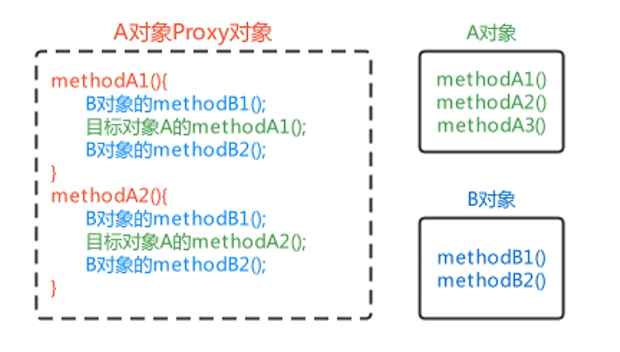
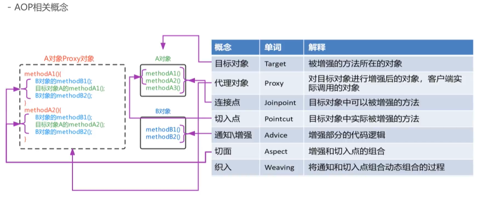
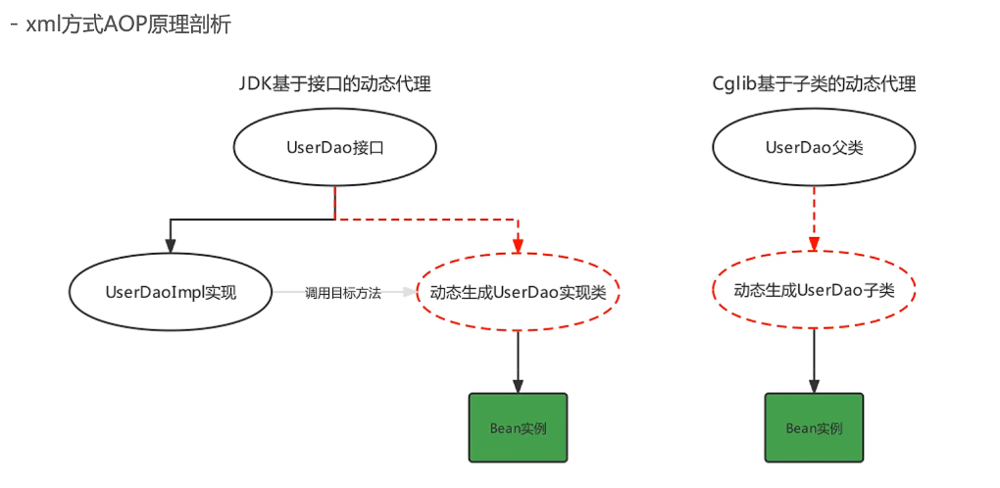
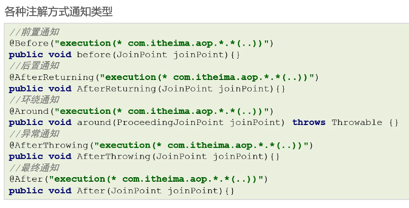

# AOP

- [AOP](#aop)
  - [1. 介绍](#1-介绍)
  - [2. 模拟AOP实现](#2-模拟aop实现)
  - [3. 基于xml配置的AOP](#3-基于xml配置的aop)
  - [4. AOP配置的两种语法形式](#4-aop配置的两种语法形式)
  - [5. AOP动态代理的实现](#5-aop动态代理的实现)
  - [6. 基于注解的AOP使用](#6-基于注解的aop使用)

## 1. 介绍

AOP，Aspect Oriented Programming，面向切面编程。OOP是纵向对一个事物的抽象，对象包括静态的属性信息，动态的方法信息等。而AOP是横向对不同事物的抽象，属性与属性、方法与方法，对象与对象都可以组成一个切面，这种设计编程的思维叫做面向切面编程。

AOP思想的实现方案是**动态代理技术**。在运行期间，对目标对象的方法进行增强，代理对象同名方法内可以执行原有逻辑的同时，嵌入执行其他增强逻辑或其他对象的方法。



**IoC讲的是如何创建Bean，AOP讲的是如何增强Bean。**

## 2. 模拟AOP实现

首先，将UserService设为Bean，其次，增强类（Advice）为MyAdvice，它的内容如下，

```java
@Component("myAdvice")
// 增强类，内部提供增强方法
public class MyAdvice {
    public void beforeAdvice() {
        System.out.println("前置的增强...");
    }
    public void afterAdvice() {
        System.out.println("后置的增强...");
    }
}
```

最后，创建一个BeanPostProcessor，实现Bean功能的增强，

```java
@Component
public class MockAopBeanPostProcessor implements BeanPostProcessor, ApplicationContextAware {

    private ApplicationContext applicationContext;

    @Override
    public Object postProcessAfterInitialization(Object bean, String beanName) throws BeansException {
        // 目的：对UserServiceImpl中的show1和show2方法进行增强，增强方法在MyAdvice中
        // 问题1：筛选增强对象，筛选service.impl包下的所有类的所有方法都可以增强
        // 问题2：如何获取MyAdvice 解决方案：从Spring容器中获得MyAdvice
        if (bean.getClass().getPackage().getName().equals("com.example.service.impl")) {
            // 生成当前Bean的Proxy对象
            return Proxy.newProxyInstance(
                    bean.getClass().getClassLoader(),
                    bean.getClass().getInterfaces(),
                    (proxy, method, args) -> {
                        // 执行增强对象的before方法
                        MyAdvice myAdvice = applicationContext.getBean(MyAdvice.class);
                        myAdvice.beforeAdvice();
                        // 执行目标对象目标方法
                        Object result = method.invoke(bean, args);
                        // after方法
                        myAdvice.afterAdvice();
                        return result;
                    }
            );
        }
        return BeanPostProcessor.super.postProcessAfterInitialization(bean, beanName);
    }

    @Override
    public void setApplicationContext(ApplicationContext applicationContext) throws BeansException {
        this.applicationContext = applicationContext;
    }
}
```

其中，ApplicationContextAware是为了自动注入applicationContext，以获取增强类MyAdvice。

此时，从Spring容器中获取的UserService已经被增强了。

AOP中有许多术语需要了解，

| 概念      | 单词       | 解释                                           |
| --------- | ---------- | ---------------------------------------------- |
| 目标对象  | Target     | 被增强方法所在的对象                           |
| 代理对象  | Proxy      | 对目标对象进行增强的对象，客户端实际调用的对象 |
| 连接点    | Jointpoint | 目标对象中可以被增强的方法                     |
| 切入点    | Pointcut   | 目标对象中实际被增强的方法                     |
| 通知\增强 | Advice     | 增强部分的代码逻辑                             |
| 切面      | Aspect     | 增强和切入点的组合                             |
| 织入      | Weaving    | 将通知和切入点动态组合的过程                   |



## 3. 基于xml配置的AOP

模拟AOP实现中，存在一些问题，

- 被增强的包名在代码中写死了

- 通知对象的方法在代码中写死了

通过Spring xml配置的方式实现AOP，解决上述问题，

- 配置哪些包、哪些类、哪些方法需要被增强

- 配置目标方法要被哪些通知方法所增强，在目标方法执行之前还是之后进行增强

xml配置AOP的步骤，

- 导入AOP相关坐标

```xml
<dependency>
  <groupId>org.aspectj</groupId>
  <artifactId>aspectjweaver</artifactId>
  <version>1.9.6</version>
  <scope>runtime</scope>
</dependency>
```

- 准备目标类、通知类，并配置给Spring管理

```xml
<!--目标类-->
<bean id="userService" class="com.example.service.impl.UserServiceImpl"/>
<!--通知类-->
<bean id="myAdvice" class="com.example.advice.MyAdvice"/>
```

- 配置**切点表达式**（哪些方法被增强）

- 配置**织入**（切点被哪些通知方法增强，是前置增强还是后置增强）

```xml
<!--aop配置-->
<aop:config>
  <!--配置切点表达式，目的是要指定哪些方法被增强-->
  <aop:pointcut id="myPointcut" expression="execution(void com.example.service.impl.UserServiceImpl.show1())"/>
  <!--配置织入，目的是要执行哪些切点与哪些通知进行结合-->
  <aop:aspect ref="myAdvice">
    <aop:before method="beforeAdvice" pointcut-ref="myPointcut"/>
  </aop:aspect>
</aop:config>
```

切点表达式是配置要对哪些连接点进行通知增强，语法如下：

```context
execution([访问修饰符]返回值类型 包名.类名.方法名(参数名))
```

其中，

- 访问修饰符可以省略不写

- 返回值类型、某一级包名、类名、方法名可以用 *表示任意

- 包名与类名之间使用单点.表示该包下的类，使用双点..表示该包及其子包下的类

- 参数列表可以使用两个点..表示任意参数

aspectj的通知有五种类型，

| 通知名称 | 配置方式               | 执行时机                                                     |
| -------- | ---------------------- | ------------------------------------------------------------ |
| 前置通知 | \<aop:before>          | 目标方法执行之前                                             |
| 后置通知 | \<aop:after-returning> | 目标方法执行之后，目标方法发生异常时，不再执行               |
| 环绕通知 | \<aop:around>          | 目标方法执行前后执行，目标方法发生异常时，环绕后方法不再执行 |
| 异常通知 | \<aop:after-throwing>  | 目标方法抛出异常时执行                                       |
| 最终通知 | \<aop:after>           | 不管目标方法是否有异常，最终都会执行                         |

其中，环绕通知方法如下，需要加入参数ProceedingJointpoint，表明目标方法执行时机

```java
public Object aroundAdvice(ProceedingJoinPoint proceedingJoinPoint) throws Throwable {
    System.out.println("环绕前的通知...");
    // 执行目标方法
    Object result = proceedingJoinPoint.proceed();
    System.out.println("环绕后的通知...");
    return result;
}
```

通知方法在被调用时，Spring可以传递一些必要的参数，

| 参数类型             | 作用                                                                     |
| -------------------- | ------------------------------------------------------------------------ |
| Jointpoint           | 连接点对象，任何通知都可以使用，可以获得当前目标对象、目标方法参数等信息 |
| ProceedingJointpoint | Jointpoint子类对象，主要是在环绕通知中执行proceed()，即执行目标方法      |
| Throwable            | 异常对象，使用在异常通知中，需要在配置文件中指出异常对象名称             |

Throwable在使用时，需要在配置中声明异常的参数名，配置有，

```xml
<aop:after-throwing method="afterThrowing" pointcut-ref="myPointcut" throwing="th"/>
```

## 4. AOP配置的两种语法形式

AOP的xml配置有两种方式，

- 使用\<advisor>配置切面，通知类需要实现Spring提供的Advice接口，Advice是一个空接口，它还有很多子接口

- 使用\<aspect>配置切面（前文所述的方法）

通知类，

```java
public class MyAdvice2 implements MethodBeforeAdvice, AfterReturningAdvice {
    @Override
    public void before(Method method, Object[] args, Object target) throws Throwable {
        System.out.println("前置通知...");
    }

    @Override
    public void afterReturning(Object returnValue, Method method, Object[] args, Object target) throws Throwable {
        System.out.println("后置通知...");
    }
}
```

xml配置，

```xml
<!--目标类-->
<bean id="userService" class="com.example.service.impl.UserServiceImpl"/>
<!--通知类-->
<bean id="myAdvice2" class="com.example.advice.MyAdvice2"/>

<!--Advisor配置实现aop-->
<aop:config>
  <aop:pointcut id="myPointcut" expression="execution(* com.example.service.impl..*.*(..))"/>
  <aop:advisor advice-ref="myAdvice2" pointcut-ref="myPointcut"/>
</aop:config>
```

这种配置方法，不需要在xml配置文件中，显示声明通知的类别，而是在通知类种实现的接口来指明通知的类别。

AOP配置的两种方式有以下区别，

- 语法形式不同
  
  - advisor通过实现接口确认通知的类型
  
  - aspect通过配置确认通知的类型，更加灵活

- 可配置的切面数量不同
  
  - 一个advisor只能配置一个固定通知和一个切点表达式
  
  - 一个aspect可以配置多个通知和多个切尔点表达式的任意组合

- 使用场景不同
  
  - 允许随意搭配的情况下可以使用aspect进行配置
  
  - 如果同通知类型单一、切面单一的情况下可以使用advisor配置
  
  - 在通知类型已经固定，不用指定通知类型时，可以使用advisor配置，例如Spring事务控制的配置

## 5. AOP动态代理的实现

有两种动态代理的实现，

| 代理技术          | 使用条件                                                                | 配置方式                                                                                                         |
| ----------------- | ----------------------------------------------------------------------- | ---------------------------------------------------------------------------------------------------------------- |
| JDK动态代理技术   | 目标类有接口，是基于接口动态生成实现类的代理对象                        | 目标类有接口，默认方式                                                                                           |
| Cglib动态代理技术 | 目标类无接口且不能用final修饰，是基于被代理对象动态生成子对象为代理对象 | 目标类无接口时，默认使用该方式；目标类有接口时，手动配置\<aop:config proxy-target-class="true">强制使用Cglib方式 |



## 6. 基于注解的AOP使用

在xml配置中，配置了三个方面：

- 目标类

- 通知类

- 织入

使用注解的步骤，

- 启用aop配置，在配置类中添加注解@EnableAspectJAutoProxy

- 将目标类和通知类交由Spring容器管理，注解@Component

- 通知类的配置如下，类上添加注解@Aspect，通知方法上添加注解@Before（前置通知）

```java
@Component("myAdvice")
@Aspect
public class MyAdvice {
    @Before("execution(* com.example.service.impl.*.*(..))")
    public void beforeAdvice() {
        System.out.println("前置的增强...");
    }
}
```



在注解中，如何抽取切面表达式？如下，

```java
@Pointcut("execution(* com.example.service.impl.*.*(..))")
public void myPointcut() {}


@Before("MyAdvice.myPointcut()")
public void beforeAdvice() {
   System.out.println("前置的增强...");
}
```
