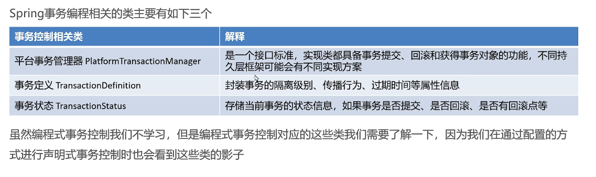
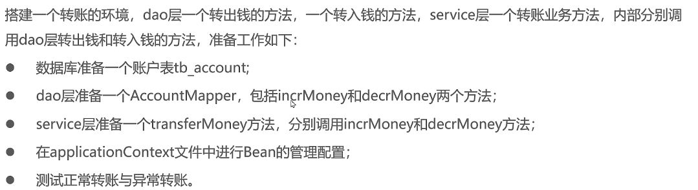
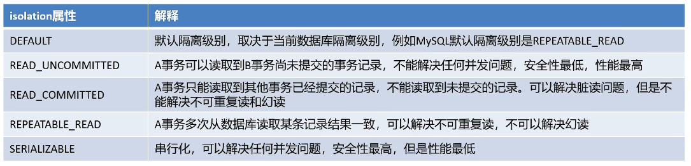
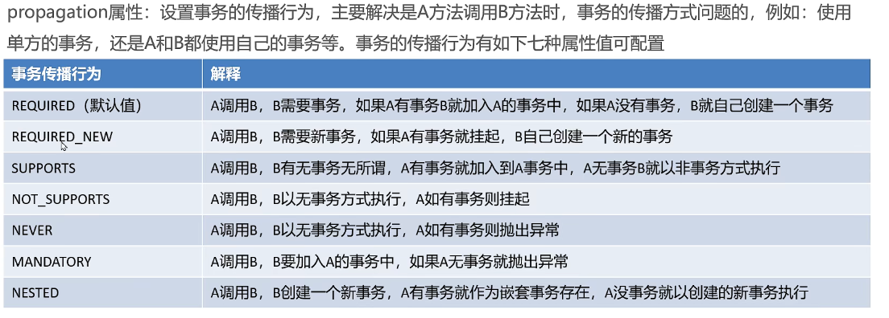

# 事务控制

事务是开发中必不可少的东西。使用JDBC时，通过connection进行事务控制；使用MyBatis时，通过SqlSession进行事务控制。事务控制方式会发生变化，Spring在这些技术基础上，提供了统一的控制事务的接口，

| 事务控制方式  | 解释                                                  |
| ------- | --------------------------------------------------- |
| 编程式事务控制 | Spring提供了事务控制的类和方法，使用编程的方式对业务代码进行事务控制。代码耦合度较高，一般不使用 |
| 声明式事务控制 | Spring将事务控制的代码封装，对外提供了xml和注解配置方式，达到解耦合的作用，推荐使用      |



通过一个转账的例子，说明Spring的事务控制。



使用Spring进行事务控制，有如下思路，

- 通知类是Spring提供的，需要导入Spring事务相关的坐标

- 配置目标类AcountServiceImpl

- 使用advisor标签配置切面

## 1. xml配置

xml配置事务管理的流程如下，

- 配置平台事务管理器，注意，不同的框架或数据库，使用的平台事务管理器实现可能不同

```xml
<!--配置平台事务管理器-->
<bean id="transactionManager" class="org.springframework.jdbc.datasource.DataSourceTransactionManager">
  <property name="dataSource" ref="dataSource"/>
</bean>
```

- 配置Spring提供的Advice。\<tx:method>配置不同方法的事务属性，name表示方法名称，\*代表通配符，它还有其他属性，
  
  - isolation属性指定事务的隔离级别，事务并发存在的三大问题：脏读、不可重复读、幻读，可通过设置事务的隔离级别保证并发问题的出现，常用的是READ_COMMITTED和REPETABLE_READ，具体信息见下图
  
  - timeout属性设置超时时间，默认-1，无超时时间，单位是秒
  
  - read-only属性，是否只读，默认false
  
  - propagation属性，事务的传播行为，解决业务方法调用业务方法（事务嵌套问题），见下图

```xml
<!--配置spring提供好的advice-->
<tx:advice id="txAdvice" transaction-manager="transactionManager">
  <tx:attributes>
    <tx:method name="*"/>
  </tx:attributes>
</tx:advice>
```





- 配置事务增强的AOP

```xml
<!--事务增强的AOP-->
<aop:config>
  <!--切点-->
  <aop:pointcut id="txPointcut" expression="execution(* com.example.service.impl.*.*(..))"/>
  <!--织入，配置spring提供好的-->
  <aop:advisor advice-ref="txAdvice" pointcut-ref="txPointcut"/>
</aop:config>
```

## 2. 注解配置

- 配置平台事务管理器

```java
@Bean
public TransactionManager transactionManager(DataSource dataSource) {
  return new DataSourceTransactionManager(dataSource);
}
```

- 配置事务增强的切入点，@Transactional注解的属性与xml配置中\<tx:method>的属性相同

```java
@Override
@Transactional
public void transferMoney(String sourceAccount, String targetAccount, Integer money) {
  accountMapper.decrementMoney(sourceAccount, money);
//        int i = 1 / 0;
  accountMapper.incrementMoney(targetAccount, money);
}
```

- 开启@Transactional注解扫描，配置类中添加注解@EnableTransactionManagement
