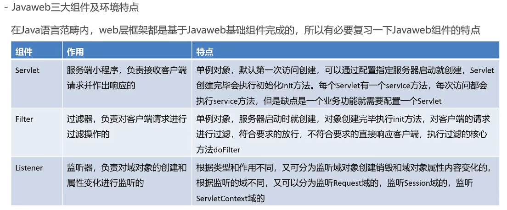
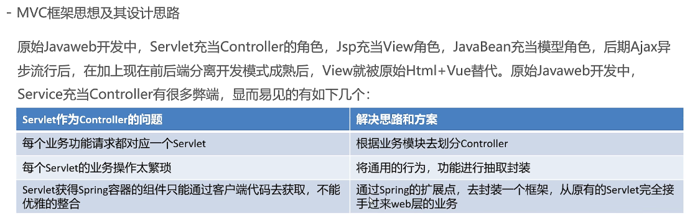
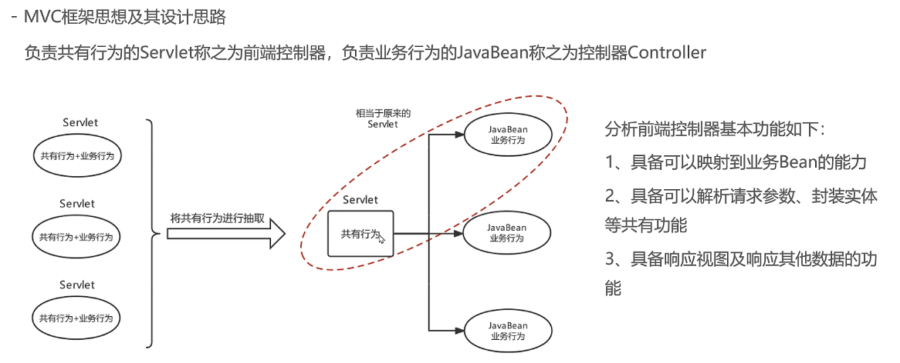

# Spring与Web

- [Spring与Web](#spring与web)
  - [1. SpringWeb](#1-springweb)

JavaWeb有三大组件，



使用Spring进行Web开发，需要实现以下三点：

- ApplicationContext创建一次，配置类加载一次

- 最好在Web服务器启动时，就执行第一步操作，后续直接从容器中获取Bean使用

- ApplicationContext的引用需要在Web层任何位置都可以获取到

因此，可以按如下思路解决，

- 在ServletContextListener的contextInitialized方法中，执行ApplicationContext的创建，或者，在Servlet的init方法中执行ApplicationContext的创建，并给Serlvet的load-on-startup属性一个数字值，确保服务器启动Servlete就创建

- 将创建好的ApplicationContext存储到SerevletContext域中，这样整个Web层任何位置就都可以获取到了

## 1. SpringWeb

- 引入坐标

```xml
<!-- https://mvnrepository.com/artifact/org.springframework/spring-web -->
<dependency>
  <groupId>org.springframework</groupId>
  <artifactId>spring-web</artifactId>
  <version>5.3.25</version>
</dependency>

<!-- https://mvnrepository.com/artifact/javax.servlet/javax.servlet-api -->
<dependency>
  <groupId>javax.servlet</groupId>
  <artifactId>javax.servlet-api</artifactId>
  <version>4.0.1</version>
  <scope>provided</scope>
</dependency>
```

- 配置web.xml

```xml
<?xml version="1.0" encoding="UTF-8"?>
<!--
     Copyright 2002 Sun Microsystems, Inc. All rights reserved.
-->
<!DOCTYPE web-app PUBLIC '-//Sun Microsystems, Inc.//DTD Web
     Application 2.3//EN' 'http://java.sun.com/dtd/web-app_2_3.dtd'>

<web-app>
    <context-param>
        <param-name>contextConfigLocation</param-name>
        <param-value>classpath:applicationContext.xml</param-value>
    </context-param>

    <listener>
        <listener-class>org.springframework.web.context.ContextLoaderListener</listener-class>
    </listener>

</web-app>
```

- 定义Serevlet

```java
@WebServlet(urlPatterns = "/UserService")
public class UserServiceServlet extends HttpServlet {

    @Override
    protected void doGet(HttpServletRequest req, HttpServletResponse resp) throws ServletException, IOException {
//        System.out.println("doGet...");
        ApplicationContext app = WebApplicationContextUtils.getWebApplicationContext(req.getServletContext());
        UserService userService = app.getBean("userService", UserService.class);
        userService.show();
    }
}
```

但是，目前仍有许多缺陷，



那么，可以有如下拆解，


