# SpringMVC的xml配置实现

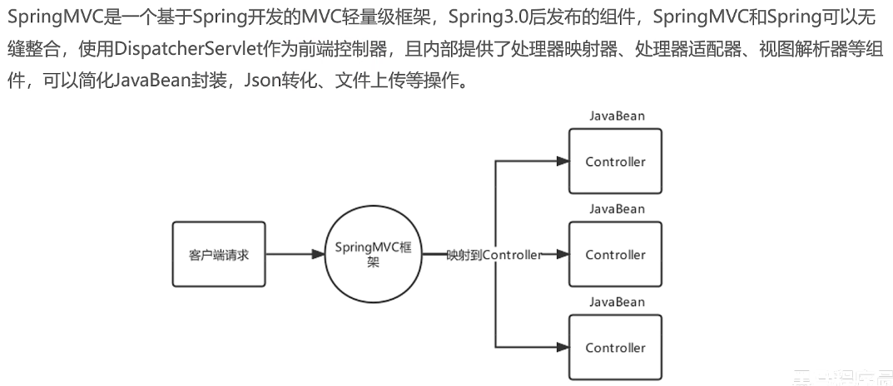

- [SpringMVC的xml配置实现](#springmvc的xml配置实现)
  - [1. SpringMVC快速使用](#1-springmvc快速使用)
  - [2. Controller中访问容器中的Bean](#2-controller中访问容器中的bean)
  - [3. SpringMVC关键组件](#3-springmvc关键组件)
  - [4. SpringMVC的请求处理](#4-springmvc的请求处理)
  - [5. 获取Get请求的键值对](#5-获取get请求的键值对)
  - [6. Post请求](#6-post请求)
  - [7. Restful风格数据](#7-restful风格数据)
  - [8. 文件上传](#8-文件上传)
  - [9. 处理请求头](#9-处理请求头)
  - [10. 访问静态资源](#10-访问静态资源)
  - [11. 注解驱动\<mvc:annotation-driven\>标签](#11-注解驱动mvcannotation-driven标签)
  - [12. 响应的处理](#12-响应的处理)
    - [12.1 同步方式](#121-同步方式)
    - [12.2 异步方式](#122-异步方式)

## 1. SpringMVC快速使用

- 导入spring-mvc坐标

- 配置前端控制器DispatcherServlet

```xml
<context-param>
    <param-name>contextConfigLocation</param-name>
    <param-value>classpath:applicationContext.xml</param-value>
</context-param>
<listener>
    <listener-class>org.springframework.web.context.ContextLoaderListener</listener-class>
</listener>

<!--配置DispatcherServlet-->
<servlet>
  <servlet-name>DispatcherServlet</servlet-name>
  <servlet-class>org.springframework.web.servlet.DispatcherServlet</servlet-class>
  <init-param>
    <!--SpringMVC容器配置文件-->
    <param-name>contextConfigLocation</param-name>
    <param-value>classpath:spring-mvc.xml</param-value>
  </init-param>
  <load-on-startup>2</load-on-startup>
</servlet>
<servlet-mapping>
  <servlet-name>DispatcherServlet</servlet-name>
  <url-pattern>/</url-pattern>
</servlet-mapping>
```

- 编写Controller，配置映射路径，并交给SpringMVC容器管理

```java
@Controller
public class QuickController {

    @RequestMapping("/show")
    public void show() {
        System.out.println("QuickController show...");
    }

}
```

## 2. Controller中访问容器中的Bean

- 建立Spring容器的xml配置（Spring容器与SpringMVC容器不同）

- 配置Service，并注册到Spring容器中

- 在web.xml配置Spring容器

```xml
<context-param>
  <param-name>contextConfigLocation</param-name>
  <param-value>classpath:applicationContext.xml</param-value>
</context-param>
<listener>
  <listener-class>org.springframework.web.context.ContextLoaderListener</listener-class>
</listener>
```

- 此时，可以在Controller中使用@Autowired注解获取Service的Bean

---

> Spring容器和SpringMVC容器
> Spring容器是父容器，SpringMVC容器是子容器，子容器可以访问父容器的内容，父容器不能访问子容器的内容。
> 通过xml配置搭建SpringMVC项目时，需要在web.xml中配置两部分内容，一是`ContextLoaderListener`，它读取的配置文件是Spring容器的配置文件applicationContext.xml，二是`DispatcherServlet`，它读取的是spring-mvc.xml。**`ContextLoaderListener`负责创建Spring容器，`DispatcherServlet`负责创建SpringMVC容器**。
> Spring容器负责管理基础的Bean，如dao和service等，SpringMVC容器负责管理Controller和解析器等和web相关的Bean。
> 如果将相同的Bean在两个容器中都进行配置，那么就会产生两份Bean，造成资源浪费，但并不会对容器的行为产生影响，因为，在Controller层进行Bean的操作，会直接去SpringMVC容器中查找Bean，而在service或dao层进行bean的操作，父容器无法访问子容器，找到的是Spring容器中的Bean。
>
> 为什么需要父子容器？
> 父子容器的主要作用是划分框架边界，实现单一职责，web层用SpringMVC容器管理，service和dao层用Spring容器管理。

---

## 3. SpringMVC关键组件

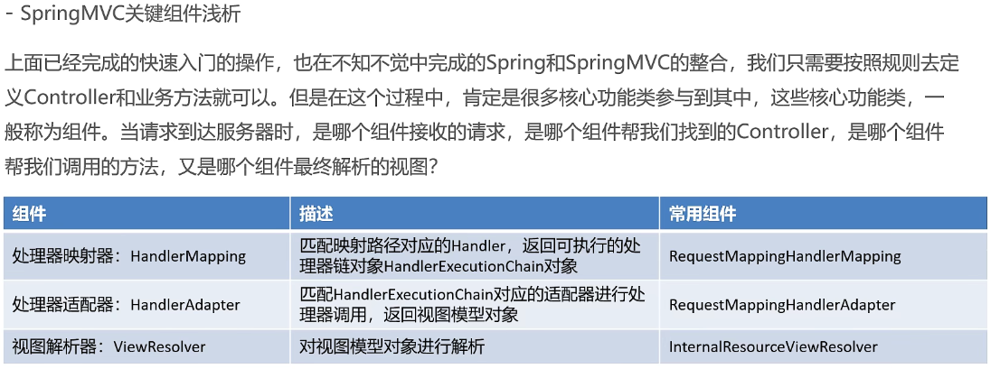

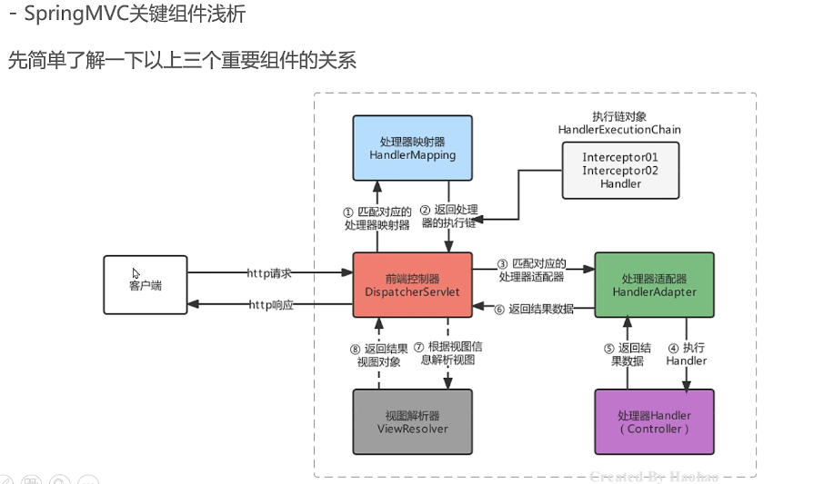

但是，这三个组件我们并没有配置，而是通过spring-mvc包中的默认配置执行的，

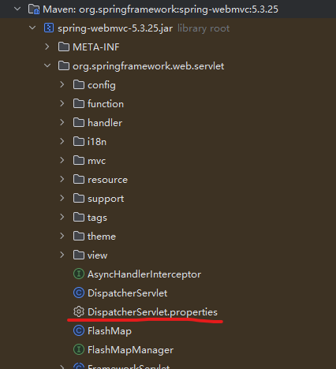

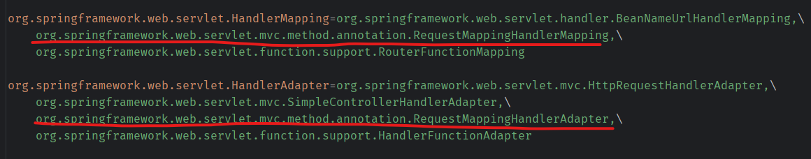

在DispatcherServlet中，维护了三个对应的集合，按照配置文件来看，每个组件加载有多个对象

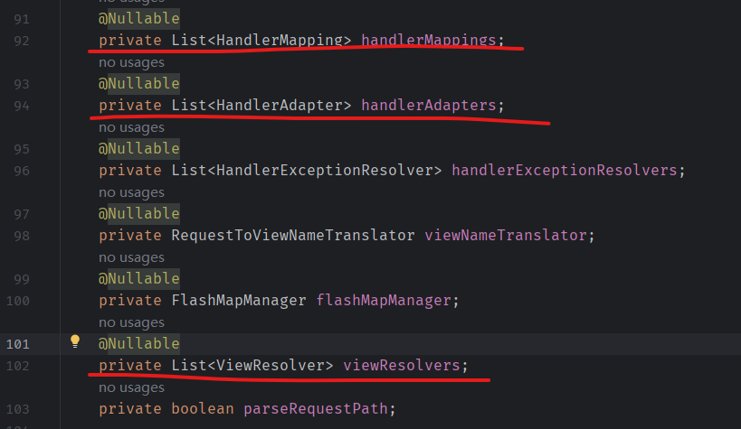

实际上，确实是这样的，以handlerMappings为例，此处获取的就是properties文件中配置的三个handlerMapping实现，

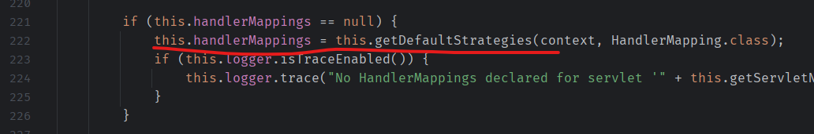

**注意，此时的这三个组件是放在DispatcherServlet中的，而不是Spring容器或者SpringMVC容器中的**，

**另外，如果在SpringMVC的配置文件中配置了handlerMapping的实现，那就不会再去加载properties配置的了**。

## 4. SpringMVC的请求处理

请求路径可以在Controller的方法上，通过注解RequestMapping配置，除此之外，还有其他注解，

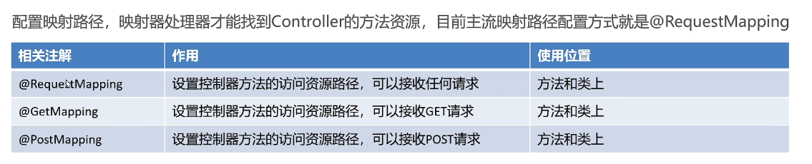

如果，RequestMapping放在类上，并且方法上也同时配置了，那么路径应该是两者路径的累加。

## 5. 获取Get请求的键值对

请求地址为，

```context
http://localhost/param1?username=zhangsan&&age=18
```

配置的Controller，

```java
@Controller
public class ParamController {

    // http://localhost/param1?username=zhangsan&&age=18
    @GetMapping("/param1")
    public String param1(String username, Integer age) {
        System.out.println("username=" + username + ",age=" + age);
        return "/index.jsp";
    }

}
```

请求的参数名应和方法中的参数名相同，如果不同的话，应该如何配置呢？在参数名上，加入@RequestParam注解

```java
// http://localhost/param1?username=zhangsan&&age=18
@GetMapping("/param1")
public String param1(
    @RequestParam("username") String name,
    @RequestParam("age") Integer age
) {
    System.out.println("username=" + name + ",age=" + age);
    return "/index.jsp";
}
```

一对多的键值对，

```java
// http://localhost:8080/param2?hobby=zp&hobby=pq&hobby=tq
@GetMapping("/param2")
public String param3(String[] hobby) {
    Arrays.stream(hobby).forEach(System.out::println);
    return "/index.jsp";
}
```

上述代码中，将数组改为集合时，报错：No primary or single unique constructor found for interface java.util.List。此时，需要在集合前加入@RequestParam注解，

```java
// http://localhost:8080/param2?hobby=zp&hobby=pq&hobby=tq
@GetMapping("/param2")
public String param3(@RequestParam List<String> hobby) {
//        Arrays.stream(hobby).forEach(System.out::println);
   if (hobby != null) hobby.forEach(System.out::println);
   return "/index.jsp";
}
```

使用map接收全部参数，

```java
// http://localhost:8080/param3?username=zhangsan&&age=18
@GetMapping("/param3")
public String param3(@RequestParam Map<String, String> params) {
    System.out.println(params);
    params.forEach((k, v) -> System.out.println("k=" + k + ",v=" + v));
    return "/index.jsp";
}
```

将接收参数封装为POJO，只要参数名称和POJO的属性名一致，就可以进行自动封装。首先，建立POJO，User和Address，

```java
public class User {

    private String username;
    private Integer age;
    private String[] hobbies;
    // 这里暂时不用LocalDate，默认情况下，解析参数需要通过反射实例化创建对象，LocalDate没有构造函数，无法反射实例化
    private Date birthday;
    private Address address;

    // getter and setter
}

public class Address {

    private String city;
    private String area;

    // getter and setter
}
```

请求地址

```context
http://localhost:8080/param4?username=zhangsan&age=18&hobbies=zq&hobbies=pq&birthday=2011/05/06
```

要使用包装的POJO，即上述的Address对象，请求地址应为，

```context
http://localhost:8080/param4?username=zhangsan&age=18&hobbies=zq&hobbies=pq&birthday=2011/05/06&address.city=china&address.area=shanghai
```

## 6. Post请求

要接收Post请求，需要在Controller中使用注解@PostMapping。Post请求的参数，存放在请求体中，获取的方法是使用@RequestBody，如下

``` java
// http://localhost:8080/param5
@PostMapping("/param5")
public String param5(@RequestBody String body) {
    System.out.println(body);
    return "/index.jsp";
}
```

现在获取的body是Json格式的字符串，要将其转为POJO对象，可以使用Json工具（如Jackson），

坐标引入，

``` xml
<dependency>
  <groupId>com.fasterxml.jackson.core</groupId>
  <artifactId>jackson-databind</artifactId>
  <version>2.14.2</version>
</dependency>
```

``` java
// http://localhost:8080/param6
@PostMapping("/param6")
public String param6(@RequestBody String body) throws JsonProcessingException {
    // 使用jackson转换json为user对象
    ObjectMapper objectMapper = new ObjectMapper();
    User user = objectMapper.readValue(body, User.class);
    System.out.println(user);
    return "/index.jsp";
}
```

上述方法中，手动的将Json字符串转为POJO不太方便，可以通过配置消息转换器解决。

在SpringMVC容器中的配置如下，

``` xml
<bean class="org.springframework.web.servlet.mvc.method.annotation.RequestMappingHandlerAdapter">
    <property name="messageConverters">
        <list>
            <bean class="org.springframework.http.converter.json.MappingJackson2HttpMessageConverter"/>
        </list>
    </property>
</bean>
```

代码可以精简为，

``` java
// http://localhost:8080/param7
@PostMapping("/param7")
public String param7(@RequestBody User user) {
    System.out.println(user);
    return "/index.jsp";
}
```

## 7. Restful风格数据

Rest（Representational State Transfer）表象化状态转变（表述性状态转变），在2000年提出，基于Http、URI、xml、JSON等标准和协议，支持轻量级、跨平台、跨语言的架构涉及，是Web服务的一种新型网络应用程序的设计风格。

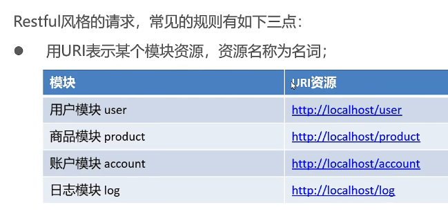  

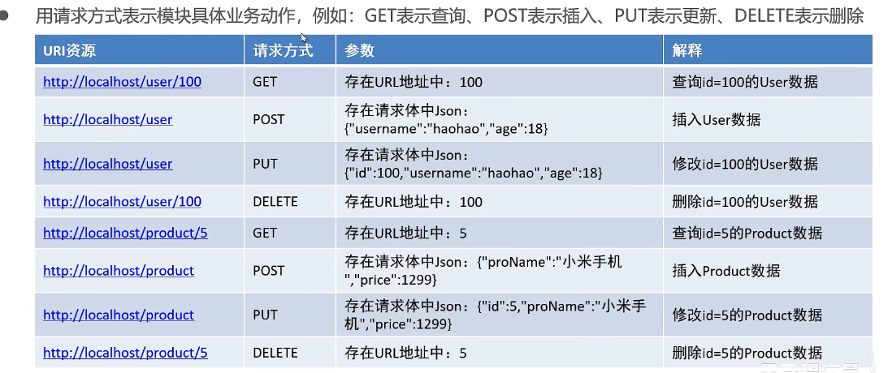  

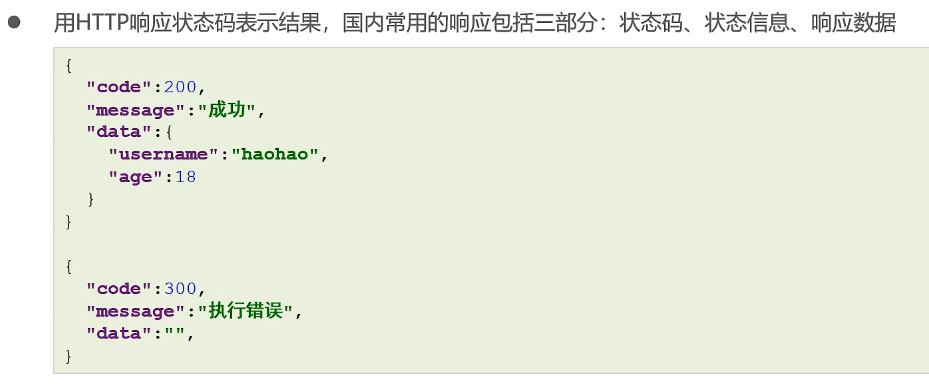  

要实现Restful风格的数据接收，代码也需要做些改变，以查询为例，使用注解PathVariable接收参数，

``` java
// http://localhost:8080/param8/100 ->根据id查询
@GetMapping ("/user/{id}")
public String findUserById(@PathVariable("id") int id) {
    System.out.println(id);
    return "/index.jsp";
}
```

## 8. 文件上传

接收文件上传的数据，上传的表单有一定的要求，

- 表单的提交方式必须是POST
- 表单的enctype属性必须是multipart/form-data
- 文件上传项要有name属性

另外，SpringMVC接收文件，需要有文件解析器，该配置默认未开启，需要手动在SpringMVC容器中开启，并且，**id必须为multipartResolver**，如下，

``` xml
<bean id="multipartResolver" class="org.springframework.web.multipart.commons.CommonsMultipartResolver"/>
```

该解析器还有其他属性可以配置，

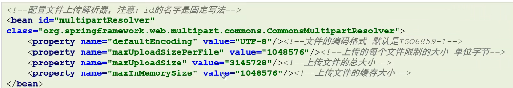  

另外，该配置有依赖需要导入，

``` xml
<!-- https://mvnrepository.com/artifact/commons-fileupload/commons-fileupload -->
<dependency>
    <groupId>commons-fileupload</groupId>
    <artifactId>commons-fileupload</artifactId>
    <version>1.5</version>
</dependency>
```

在Controller接收文件时，需要将文件对象定义为MultipartFile，POST方式的参数在请求体中，还需要使用注解RequestBody，

``` java
@PostMapping("/param8")
public String param8(@RequestBody MultipartFile myFile) {
    System.out.println(myFile);
    return "/index.jsp";
}
```

## 9. 处理请求头

获取请求头需要使用注解RequestHeader，可以指定获取头的哪个键值对或者是全部，

``` java
@PostMapping("/param9")
public String param9(@RequestHeader Map<String, String> headerValues) {
    System.out.println(headerValues);
    return "/index.jsp";
}
```

头部分还有一个重要的信息Cookie，需要使用注解CookieValue获取，

``` java
@PostMapping("/param10")
public String param10(@CookieValue("JSESSIONID") String cookie) {
    System.out.println(cookie);
    return "/index.jsp";
}
```

## 10. 访问静态资源

在原始的Web项目中，直接通过`http://localhost:8080/index.html`可以直接访问静态资源，现在使用SpringMVC后，同样的URL访问失败，报错404。这是因为SpringMVC中的DispatcherServlet使用的URL-PATTERN中使用了`/`，覆盖了Tomcat中的默认Servlet。

那应该如何访问静态资源呢？

- 方式一，在web.xml中，再次激活DefaultServlet

``` xml
<servlet-mapping>
    <servlet-name>default</servlet-name>
    <url-pattern>*.html</url-pattern>
</servlet-mapping>
```

- 方式二，在spring-mvc.xml中配置静态资源映射，使用标签\<mvc:resources>，匹配请求路径和资源

- 方式三，在spring-mvc.xml中配置\<mvc:default-servlet-handler>，该方式是注册了一个`DefaultServletHttpRequestHandler`，静态资源的访问都由该处理器处理，开发中使用最多

使用方式二和方式三访问静态资源时，如果没有显示的配置`RequestMappingHandlerMapping`，则Controller中的地址无法访问。这是因为这些方式向容器中注入了一个HandlerMapping，默认配置的`RequestMappingHandlerMapping`就不再加载了。如果要同时实现静态资源访问和Controller访问，需要显示的在spring-mvc中声明`RequestMappingHandlerMapping`的定义。

## 11. 注解驱动\<mvc:annotation-driven>标签

根据上述，在spring-mvc.xml中配置了`RequestMappingHandlerMapping`、`RequestMappingHandlerAdapter`（用于配置消息转换器），这些内容可以用一个标签代替，即，\<mvc:annotation-driven>。

该标签内部会自动注册`RequestMappingHandlerMapping`和`RequestMappingHandlerAdapter`，并注入JSON消息转换器等。

## 12. 响应的处理

响应数据主要分为两部分：

- 传统的同步方式。
- 前后端分离的异步方式。前端使用Ajax+Restful风格与服务端进行JSON格式为主的数据交互，是目前的主流方式。

### 12.1 同步方式

同步方式涉及以下四种形式，

- 转发，使用forward关键字，可省略
- 重定向，使用redirect关键字

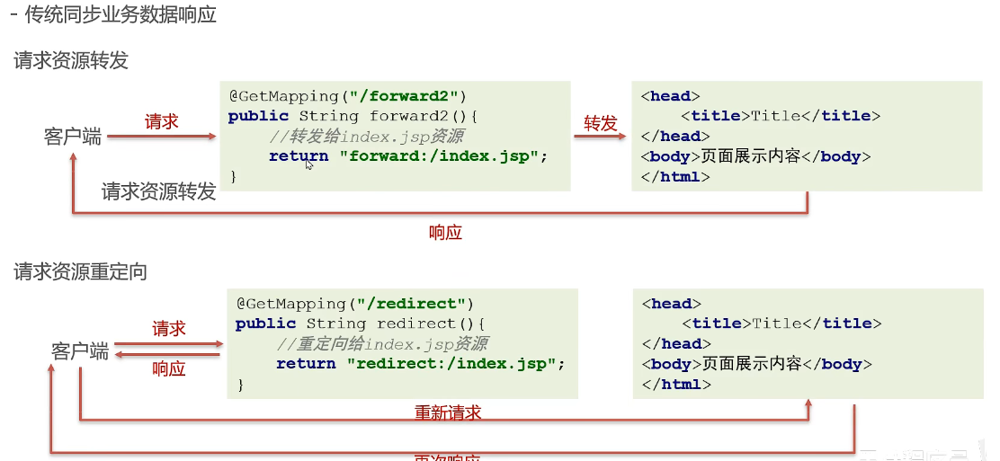  

- 响应模型数据。SpringMVC中可以使用ModelAndView设置属性值和转发的路径，代替传统的Request域，但是，目前这种方式基本上已经不适用了，

``` java
@GetMapping("/res1")
public ModelAndView res1(ModelAndView modelAndView) {
    // ModelAndView封装模型数据和视图名
    // 设置模型数据
    User user = new User();
    user.setUsername("Jim");
    user.setAge(18);
    modelAndView.addObject("user", user);
    // 设置试图名称，在页面中展示数据
    modelAndView.setViewName("/index.jsp");
    return modelAndView;
}
```

- 直接回写给客户端。返回的的字符串不是视图名，而是值，需要使用注解ResponseBody

``` java
// 直接回写字符串
@GetMapping("/res2")
@ResponseBody  // 告诉springmvc返回的字符串不是视图名，是以响应体方式响应数据
public String res2() {
    return "hello world!";
}
```

### 12.2 异步方式

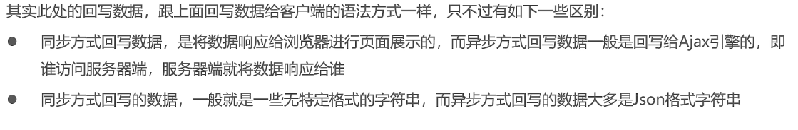  

```  java
@GetMapping("/ajax/req2")
@ResponseBody
public String req2() throws JsonProcessingException {
    User user = new User();
    user.setUsername("Jim");
    user.setAge(18);
    // json转换工具
    ObjectMapper objectMapper = new ObjectMapper();
    // 设定json字符串中不包含空值
    objectMapper.setSerializationInclusion(JsonInclude.Include.NON_NULL);
    return objectMapper.writeValueAsString(user);
}
```

其中，JSON转换可以省略，就像之前配置的消息转换器一样，直接返回User对象。

另外，注解ResponseBody可以写在类上，方法上省略，而且，注解ResponseBody和注解Controller可以合并，以符合Restful风格，合并的注解为**RestController**。
