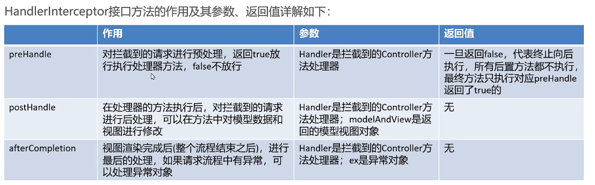

# SpringMVC的拦截器

- [SpringMVC的拦截器](#springmvc的拦截器)
  - [1. 快速使用](#1-快速使用)
  - [2. 多个拦截器的执行顺序](#2-多个拦截器的执行顺序)
  - [3. 拦截器原理](#3-拦截器原理)

  

  

  

  

- [SpringMVC的拦截器](#springmvc的拦截器)
  - [1. 快速使用](#1-快速使用)
  - [2. 多个拦截器的执行顺序](#2-多个拦截器的执行顺序)
  - [3. 拦截器原理](#3-拦截器原理)

## 1. 快速使用

拦截器需要实现`HandlerInterceptor`接口，并配置在spring-mvc.xml中，定义拦截器的拦截路径，

``` java
public class MyInterceptor1 implements HandlerInterceptor {
    @Override
    public boolean preHandle(HttpServletRequest request, HttpServletResponse response, Object handler) throws Exception {
        System.out.println("MyInterceptor1 preHandle...");
        return true;
    }

    @Override
    public void postHandle(HttpServletRequest request, HttpServletResponse response, Object handler, ModelAndView modelAndView) throws Exception {
        System.out.println("MyInterceptor1 postHandle...");
    }

    @Override
    public void afterCompletion(HttpServletRequest request, HttpServletResponse response, Object handler, Exception ex) throws Exception {
        System.out.println("MyInterceptor1 afterCompletion...");
    }
}
```

``` xml
<!--配置拦截器-->
<mvc:interceptors>
    <mvc:interceptor>
        <!--* 拦截一级路径，** 拦截多级路径-->
        <mvc:mapping path="/**"/>
        <bean class="com.example.interceptors.MyInterceptor1"/>
    </mvc:interceptor>
</mvc:interceptors>
```

## 2. 多个拦截器的执行顺序

再定义一个HandlerInterceptor，命名为MyInterceptor2，spring-mvc.xml配置如下，

``` xml
<!--配置拦截器-->
<mvc:interceptors>
    <mvc:interceptor>
        <!--* 拦截一级路径，** 拦截多级路径-->
        <mvc:mapping path="/**"/>
        <bean class="com.example.interceptors.MyInterceptor1"/>
    </mvc:interceptor>
    <mvc:interceptor>
        <mvc:mapping path="/**"/>
        <bean class="com.example.interceptors.MyInterceptor2"/>
    </mvc:interceptor>
</mvc:interceptors>
```

执行后，输出如下，

``` context
MyInterceptor1 preHandle...
MyInterceptor2 preHandle...
req2...
MyInterceptor2 postHandle...
MyInterceptor1 postHandle...
MyInterceptor2 afterCompletion...
MyInterceptor1 afterCompletion...
```

替换两个拦截器的配置顺序，输出如下，

``` context
MyInterceptor2 preHandle...
MyInterceptor1 preHandle...
req2...
MyInterceptor1 postHandle...
MyInterceptor2 postHandle...
MyInterceptor1 afterCompletion...
MyInterceptor2 afterCompletion...
```

由此可见，**拦截器的执行顺序取决于配置的顺序**。具体方法的执行顺序，有下图，

  

  

注意，afterCompletion是否执行，取决于它的preHandle是否返回true。

## 3. 拦截器原理

  
