# SpringMVC的全注解开发

为实现SpringMVC的全注解开发，主要有三部分，

- spring-mvc.xml中组件转化为注解形式
- DispatcherServlet加载核心配置类
- 消除web.xml

- [SpringMVC的全注解开发](#springmvc的全注解开发)
  - [1. spring-mvc.xml中组件转化为注解形式](#1-spring-mvcxml中组件转化为注解形式)
  - [2. DispatcherServlet加载核心配置类](#2-dispatcherservlet加载核心配置类)
  - [3. 消除web.xml](#3-消除webxml)
    - [3.1 ServletContainerInitializer](#31-servletcontainerinitializer)
    - [3.2 SpringServletContainerInitializer](#32-springservletcontainerinitializer)
  - [4. 总结](#4-总结)
  - [5. 一些原理](#5-一些原理)

## 1. spring-mvc.xml中组件转化为注解形式

spring-mvc.xml中的配置如下，

``` xml
<!--组件扫描-->
<context:component-scan base-package="com.example.controller"/>

<!--配置文件上传解析器-->
<bean id="multipartResolver" class="org.springframework.web.multipart.commons.CommonsMultipartResolver"/>

<!--非Bean的配置-->
<mvc:default-servlet-handler/>

<mvc:annotation-driven/>

<!--配置拦截器-->
<mvc:interceptors>
    <mvc:interceptor>
        <mvc:mapping path="/**"/>
        <bean class="com.example.interceptors.MyInterceptor2"/>
    </mvc:interceptor>

    <mvc:interceptor>
        <!--* 拦截一级路径，** 拦截多级路径-->
        <mvc:mapping path="/**"/>
        <bean class="com.example.interceptors.MyInterceptor1"/>
    </mvc:interceptor>
</mvc:interceptors>
```

- 组件扫描和非自定义的Bean配置转为注解的形式，和spring中的一样，可以在配置类中使用注解ComponentScan和Bean解决；
- 非Bean的配置可以使用注解EnableWebMvc

注解EnableWebMvc如下，

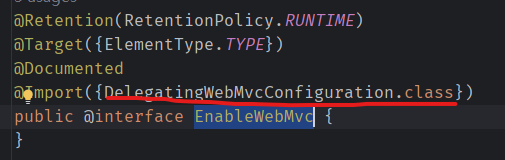  

它的关键是导入的配置类DelegatingWebMvcConfiguration，它继承自WebMvcConfigurationSupport，

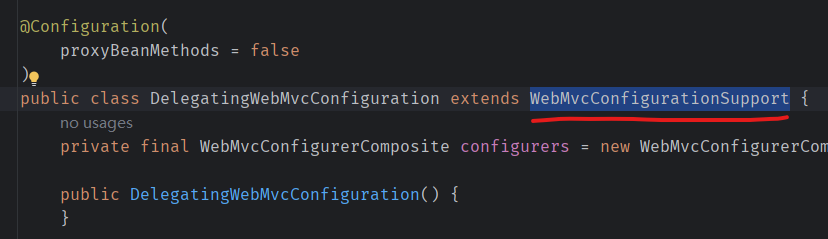  

在WebMvcConfigurationSupport中使用注解Bean定义了许多配置，解决标签\<mvc:annotation-driven/>的注解实现。

另外，如何实现Interceptor和DefaultServletHandler的注解形式呢？

在DelegatingWebMvcConfiguration中，有一个setConfigurers的方法，

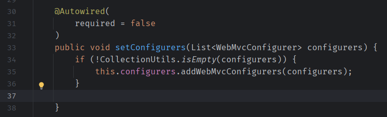  

其中的WebMvcConfigurer是一个接口，有如下方法，

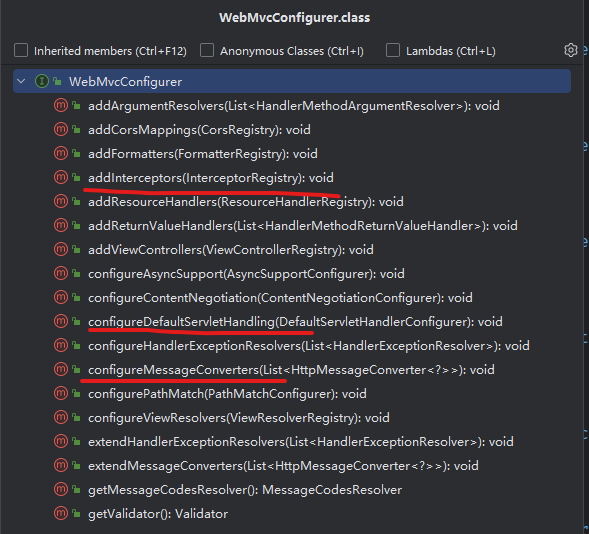  

通过自定义类实现该接口，即可实现Interceptor和DefaultServletHandler的注解形式。

由此，spring-mvc.xml替换为注解的形式，即为，

配置类，

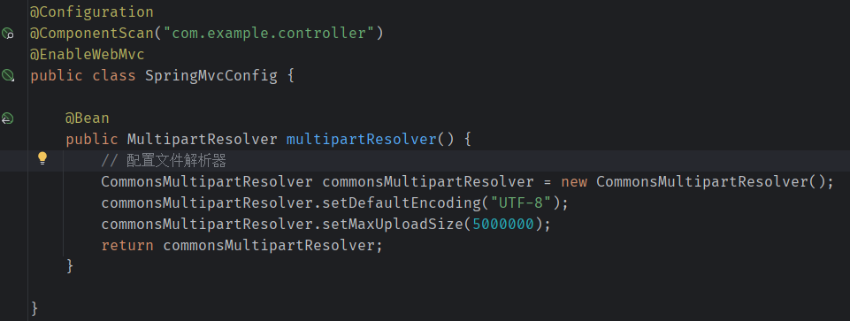  

定义WebMvcConfigurer以实现Interceptor和DefaultServletHandler，

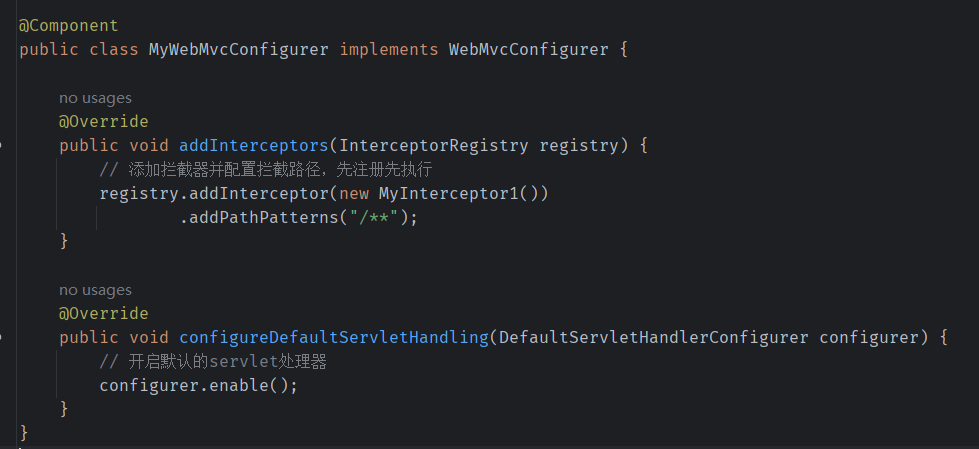  

注解形式的配置已经完成。

## 2. DispatcherServlet加载核心配置类

启动SpringMVC容器读取的配置在web.xml中，在参数contextConfigLocation中设置，如何将它替换为配置类呢？

``` xml
<!--配置DispatcherServlet-->
<servlet>
    <servlet-name>DispatcherServlet</servlet-name>
    <servlet-class>org.springframework.web.servlet.DispatcherServlet</servlet-class>
    <init-param>
        <param-name>contextConfigLocation</param-name>
        <param-value>classpath:spring-mvc.xml</param-value>
    </init-param>
    <load-on-startup>2</load-on-startup>
</servlet>
<servlet-mapping>
    <servlet-name>DispatcherServlet</servlet-name>
    <url-pattern>/</url-pattern>
</servlet-mapping>
```

见下图的说明，

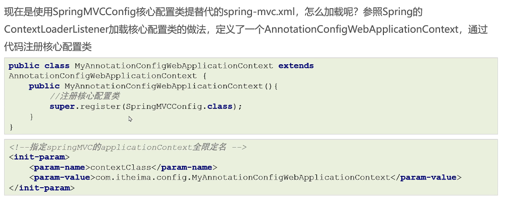  

如此完全去除了spring-mvc.xml的配置。

## 3. 消除web.xml

web.xml中主要包含两项配置，一是ContextLoaderListener，用于启动Spring容器，二是DispatcherServlet，用于启动SpringMVC容器。如何将他们也都转化为注解形式的配置呢？

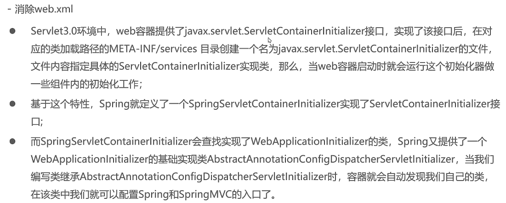  

### 3.1 ServletContainerInitializer

测试使用ServletContainerInitializer，

- 自定义类实现ServletContainerInitializer接口
- 在resources下创建目录META-INF/services，在该路径下创建文件，名称为ServletContainerInitializer的全路径，即javax.servlet.ServletContainerInitializer，文件中写明自定义类的全路径，即com.example.init.MyServletContainerInitializer

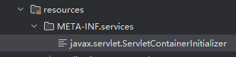  

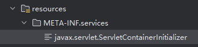  

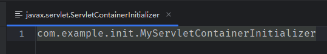  

此时，启动的输出为，

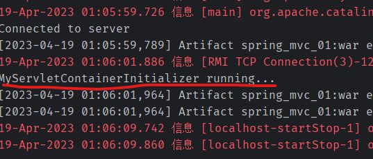  

在ServletContainerInitializer的注释中，说明了onStartup方法的使用，需要添加注解HandlesTypes，声明需要注入类的接口（而实际注入为接口的实现子类），由此，可以将该类通过另一个参数ServletContext，添加listener等。

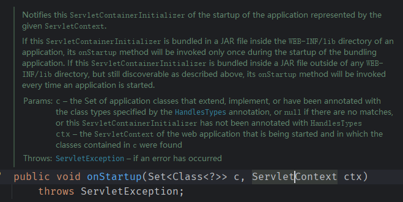  

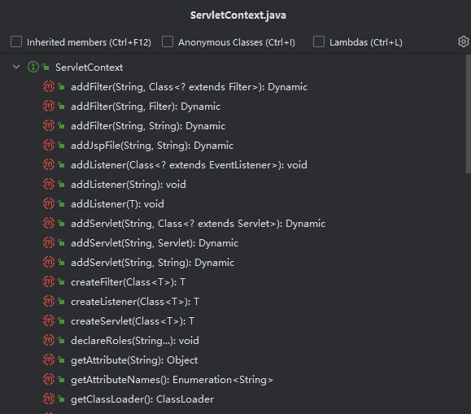  

### 3.2 SpringServletContainerInitializer

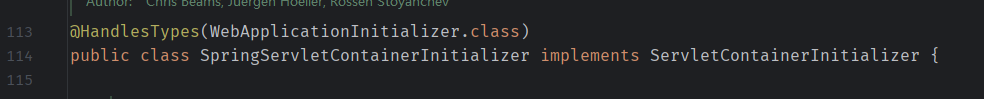  

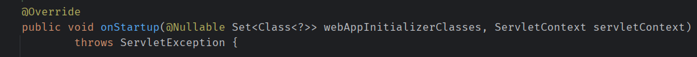  

SpringServletContainerInitializer实现了ServletContainerInitializer，它从属于spring-web包，在该包下，它也做了相同的配置，

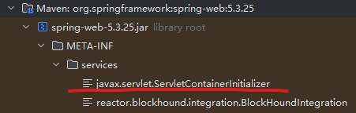  

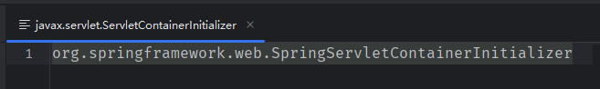  

通过Debug模式启动，观察它的onStartup方法，参数webAppInitializerClasses有以下内容，

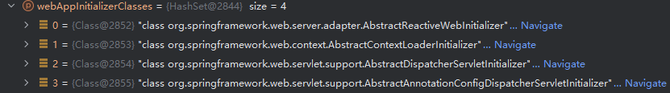  

这四个类即为接口WebApplicationInitializer的四个实现，

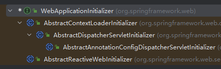  

因此，可以使用WebApplicationInitializer实现Spring容器和SpringMVC容器配置的读取，

以AbstractAnnotationConfigDispatcherServletInitializer为例，

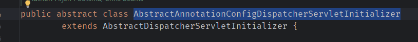  

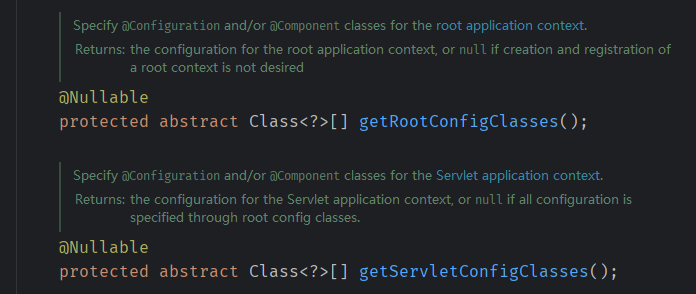  

可以通过实现以上两个方法，设置两个容器的配置类读取。

> Spring容器称为RootApplicationContext，SpringMVC容器称为ServletApplicationContext。

另有一个方法需要实现，以设置映射路径，代码如下，

``` java
public class MyAbstractAnnotationConfigDispatcherServletInitializer extends AbstractAnnotationConfigDispatcherServletInitializer {

    // 提供Spring容器的核心配置类
    @Override
    protected Class<?>[] getRootConfigClasses() {
        return new Class[]{SpringConfig.class};
    }

    // 提供SpringMVC容器的核心配置类
    @Override
    protected Class<?>[] getServletConfigClasses() {
        return new Class[]{SpringMvcConfig.class};
    }

    // 提供前端映射路径
    @Override
    protected String[] getServletMappings() {
        return new String[]{"/"};
    }
}
```

至此，完成了web.xml的注解实现。

---

## 4. 总结

> 1. 自定义类继承AbstractAnnotationConfigDispatcherServletInitializer，设置Spring容器和SpringMVC容器的配置类，以及映射路径；
>
> 2. SpringMVC配置类中使用注解ComponentScan，配置Controller的扫描路径，解析器等可以通过注解Bean注入容器中；
>
> 3. 拦截器和默认Servlet启用的配置，通过实现接口WebMvcConfigurer设置，并使用注解Component使SpringMVC容器发现。

## 5. 一些原理

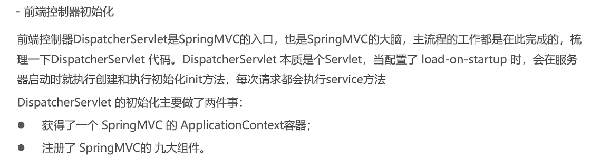  

DispatcherServlet中有注册九大组件，它是通过**事件发布**机制实现的，

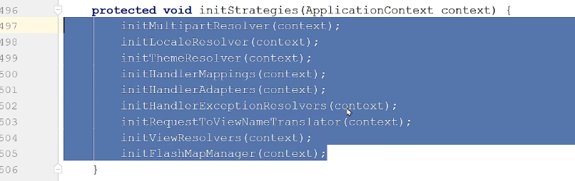  
